# PrivacyDesk — DSR & Consent Hub (KendoReact Free)

PrivacyDesk is a React + TypeScript app for managing privacy requests (Access / Delete / Export / Correct). It lets teams intake requests, triage them, track SLAs, capture notes/evidence, and export a runbook.

- **Repo**: [Privacy Desk Repo](https://github.com/sindhurani29/PrivacyDesk)
- **Live demo**: [Demo](https://drive.google.com/file/d/1t8elCHlfeLXLnMfPngjm3TdP6eB6f-8F/view?usp=share_link)

## Challenge: DEV × KendoReact Free Components

### What I Built

- **Requests**: filter, sort, and page through requests; status badges; open a case.
- **New Request**: guided flow to create a request with validation.
- **Case Workspace**: overview, notes, evidence, history; SLA progress with due indicator.
- **Export**: print-friendly runbook and deterministic JSON download.
- **Settings**: adjust SLA days per request type.
- **Auth (sample)**: simple login inputs you can replace with real auth.
- **No Pro components**: only KendoReact Free.

## How to Run

```bash
git clone https://github.com/sindhurani29/PrivacyDesk
cd PrivacyDesk
npm i
npm run dev
# open the printed URL (e.g., http://localhost:5173)
```

Make sure the Kendo theme is imported once:

```typescript
// src/main.tsx
import '@progress/kendo-theme-default/dist/all.css';
```

## App Map (Routes)

- `/` — Dashboard (overview widgets)
- `/requests` — Requests list (Grid, filters, actions)
- `/new` — New request wizard
- `/case/:id` — Case workspace (tabs: Overview, Notes, Evidence, History)
- `/settings` — SLA and app settings

## KendoReact Free Components Used (≥10)

All components below are from the KendoReact Free tier, no Pro-only features are used.

### Grid — Requests table with paging/sorting
- `src/components/Requests/RequestGrid.tsx`
- `src/pages/Requests/RequestGrid.tsx`

### DropDownList — Filters and pickers (Request type, Status, etc.)
- `src/components/Requests/FiltersBar.tsx`
- `src/pages/Requests/FiltersBar.tsx`
- `src/pages/NewRequest/StepRequester.tsx`
- `src/pages/NewRequest/StepDetails.tsx`
- `src/pages/Case/CasePage.tsx`

### MultiSelect — Owner filter with chips
- `src/components/Requests/FiltersBar.tsx`
- `src/pages/Requests/FiltersBar.tsx`

### DatePicker — From/To date range in filters
- `src/components/Requests/FiltersBar.tsx`

### Input / TextArea — Requester name/email, notes, rationale, etc.
- `src/pages/Auth/LoginPage.tsx`
- `src/pages/NewRequest/StepRequester.tsx`
- `src/pages/NewRequest/StepDetails.tsx`
- `src/pages/Case/CasePage.tsx`
- `src/pages/Case/NotesPanel.tsx`
- `src/pages/Settings/SettingsPage.tsx`

### Switch — "ID proof received?" toggle
- `src/pages/NewRequest/StepDetails.tsx`

### Badge — Status pills (new / in_progress / waiting / done / rejected)
- `src/components/Common/StatusBadge.tsx` (used by requests/case views)

### ProgressBar — SLA progress visualization
- `src/pages/Dashboard/DashboardPage.tsx`
- `src/pages/Case/SLAWidget.tsx`

### TabStrip — Case tabs (Overview | Notes | Evidence | History)
- `src/pages/Case/CasePage.tsx`

### Dialog / DialogActionsBar — Confirm actions (Finalize, Delete note, etc.)
- `src/components/Common/ConfirmDialog.tsx`
- `src/components/Requests/RequestGrid.tsx`
- `src/pages/Case/CasePage.tsx`

### Window — Export preview (print + JSON download)
- `src/pages/Runbook/PreviewWindow.tsx`

### NumericTextBox — SLA days per request type (Settings)
- `src/pages/Settings/SettingsPage.tsx`

### Toolbar / ToolbarItem / ToolbarSeparator — Filters toolbar
- `src/components/Requests/FiltersBar.tsx`

### Label — Accessible labels in Filters
- `src/components/Requests/FiltersBar.tsx`

### Button — Primary/secondary actions app-wide
Multiple files (RequestGrid, dialogs, wizard, settings, etc.)

**Quick verify:**
```bash
grep -R "@progress/kendo-react-" -n src | sort
```

## Accessibility Highlights

- Icon-only buttons have `aria-label`.
- Dialog/Window trap focus and close with Esc.
- TabStrip supports keyboard navigation (arrow keys).
- Inputs are labeled; helper text uses `aria-describedby`.
- Visible focus outlines are preserved.

## Export & Deterministic JSON

- Export window shows a print-friendly case summary.
- "Download JSON" sorts keys before `JSON.stringify` so diffs are stable.

## (Bonus) Kendo UI AI Coding Assistant — How I Used It

Short entries you can keep in the repo or DEV post:

### Requests Grid
**Prompt**: @kendoreact Create a KendoReact Grid (TypeScript) for privacy requests with columns: id, type, requester.email, submittedAt (date), dueAt (date), status rendered with a Kendo Badge, owner, and an Actions column with a small "Open" button that navigates to /case/:id.
Enable paging (10 rows/page), sorting, and column menus. No custom CSS. Use existing data prop and useNavigate for route.
**Commit**: [Requests Grid](https://github.com/sindhurani29/PrivacyDesk/pull/2/commits)

### New Request Stepper
**Prompt**: @kendoreact Create a Kendo Stepper (TypeScript) with 3 steps: Requester →
Details → Confirm.
Manage active index in state and render StepRequester, StepDetails, StepConfirm accordingly.
Add Next/Back handlers. No custom CSS.
**Commit**: [New Request Stepper](https://github.com/sindhurani29/PrivacyDesk/pull/4/commits)

### Filters ToolBar
**Prompt**: @kendoreact Build a KendoReact filters toolbar (TypeScript) with:
* Type: DropDownList of access delete|export|correct/all
* Status: DropDownList of
new in_progress|waiting/done/reject ed/all
* Owner: MultiSelect from a provided owners array
* Date range: two DatePicker fields
(From, To)
Controlled via props: { type, setType, status, setStatus, owner, setOwner, dateFrom, setDateFrom, dateTo, setDateTo }.
No custom CSS.
**Commit**: [Filters ToolBar](https://github.com/sindhurani29/PrivacyDesk/pull/3/commits)

Screenshots (assistant + resulting UI) are recommended in `/docs/screenshots`.

## Screenshots

- `docs/requestGridPrompt.png`
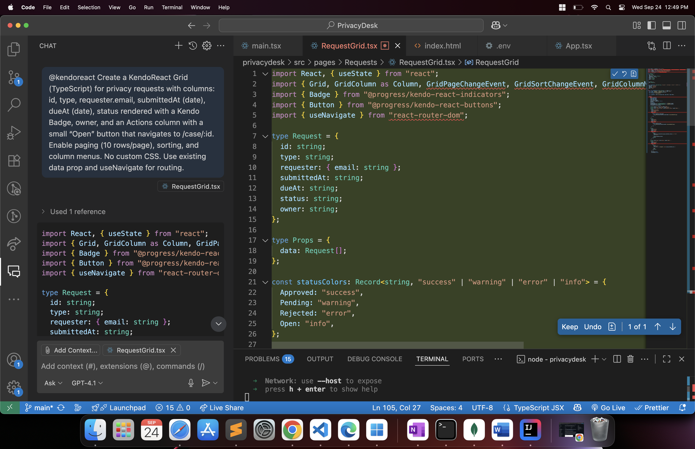
- `docs/requestsPage.png`
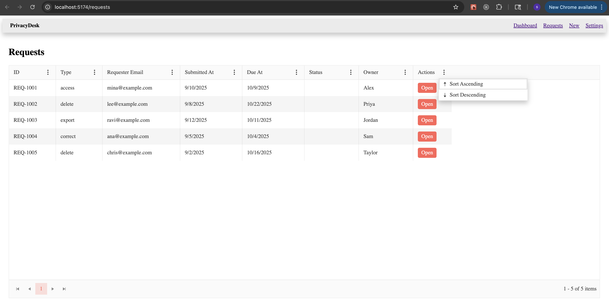
- `docs/wizardPrompt.png`
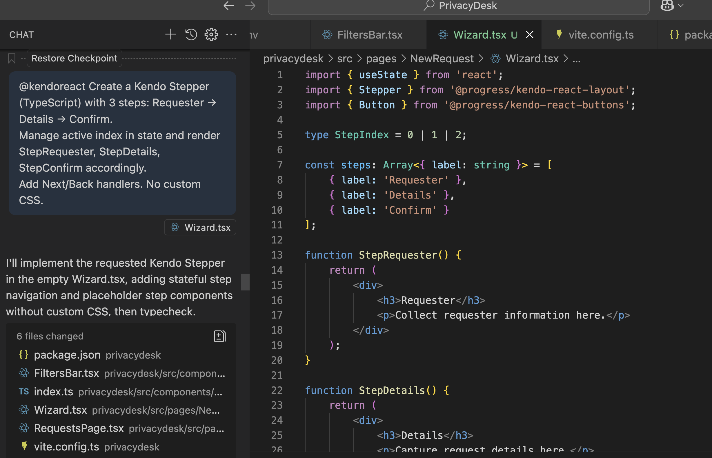
- `docs/wizardOutput.png`
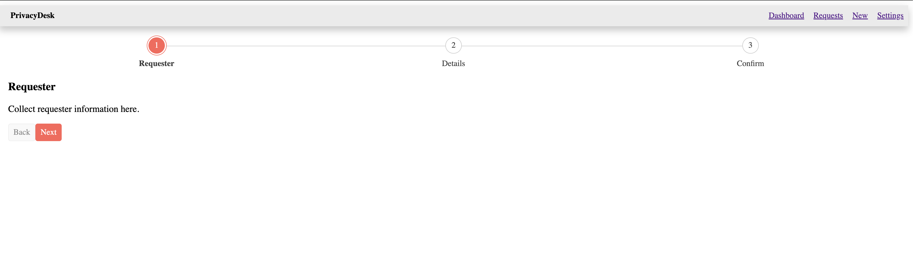
- `docs/filtersBar_prompt.png`
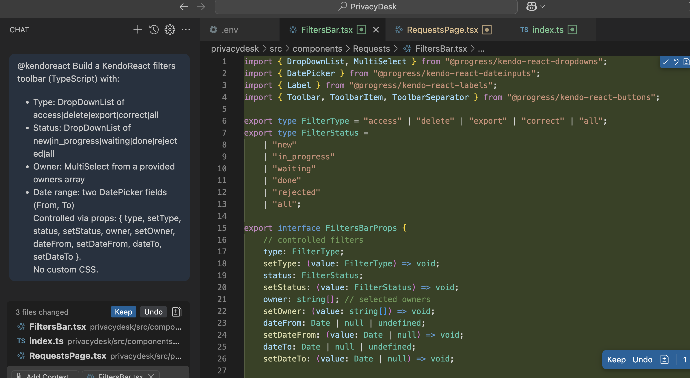
- `docs/filtersBar.png`
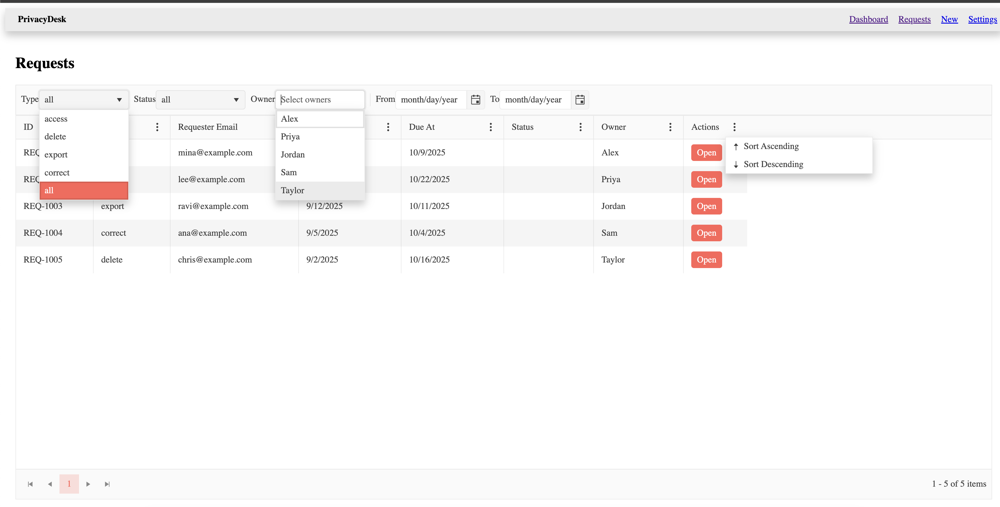

## Scripts

```bash
npm run dev       # local development
npm run build     # production build
npm run preview   # preview the production build locally
```

### Here are the final pages images of the application:

### Login
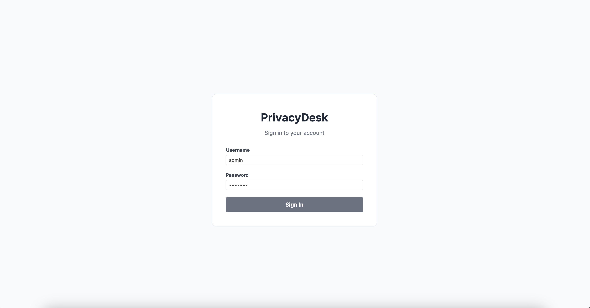
### Dashboard
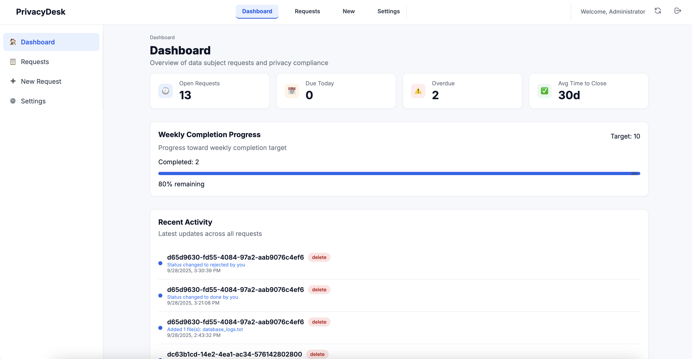
### Requests — Grid & Filters
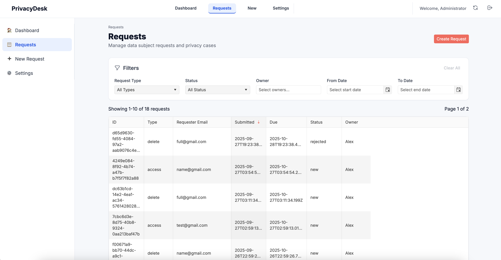
### New Request — Step 1 (Requester)

### New Request — Step 2 (Details)

### New Request — Step 3 (Confirm)

### Requested created with notification

### Case — Header & Overview (Status Badge, Owner, SLA)

### Case — Notes (add/delete note dialog)
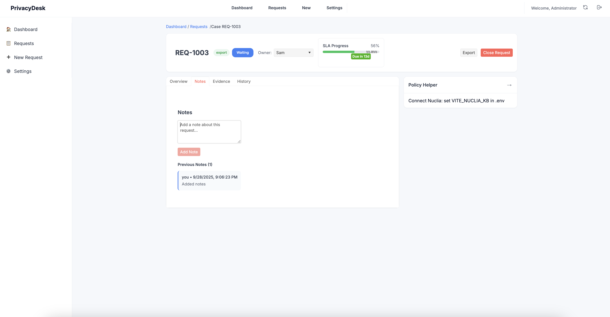
### Case — Evidence
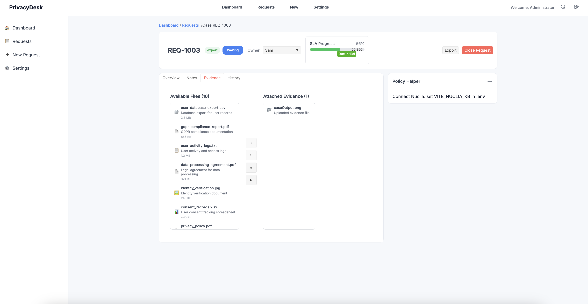
### Case — History
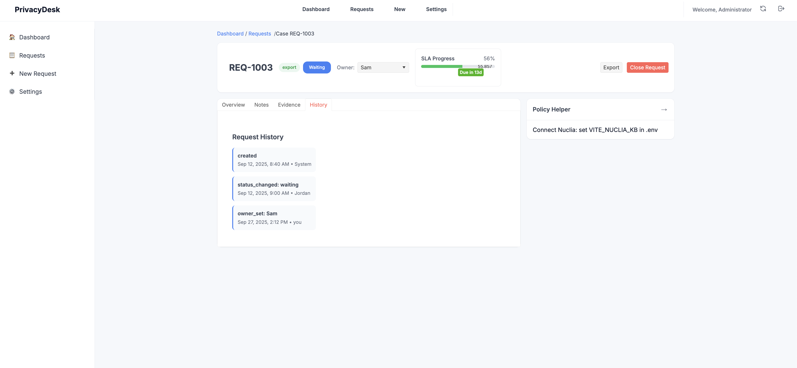
### Export — Print & JSON

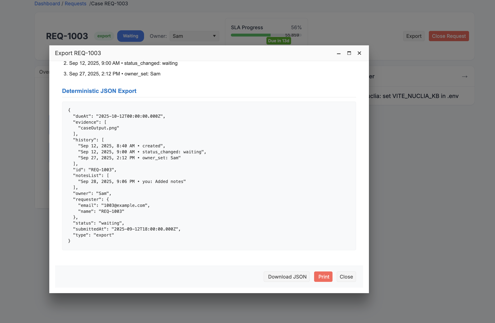
### Settings — SLA per Request Type
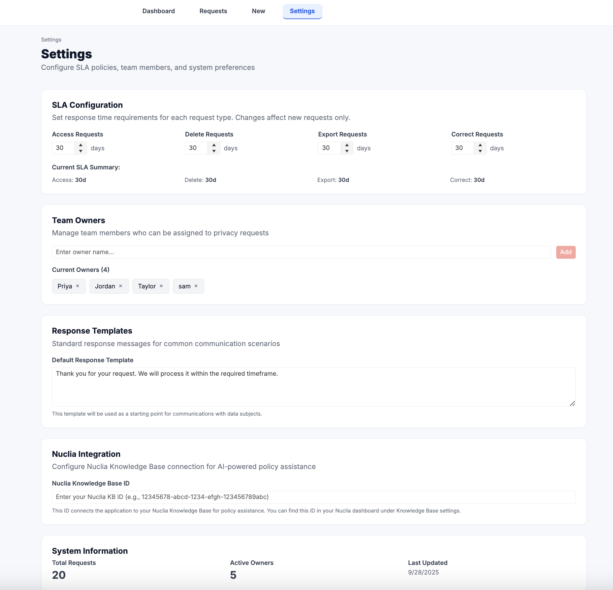